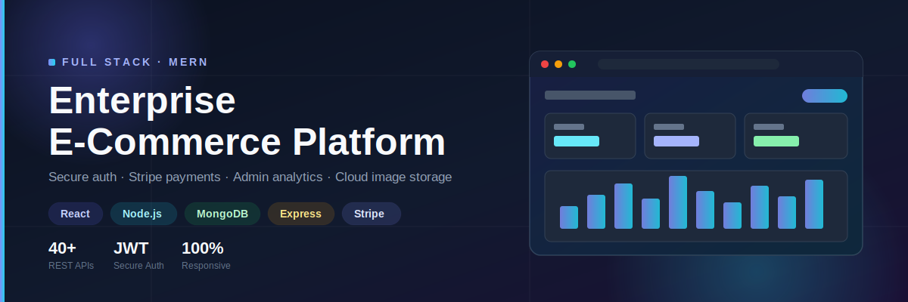
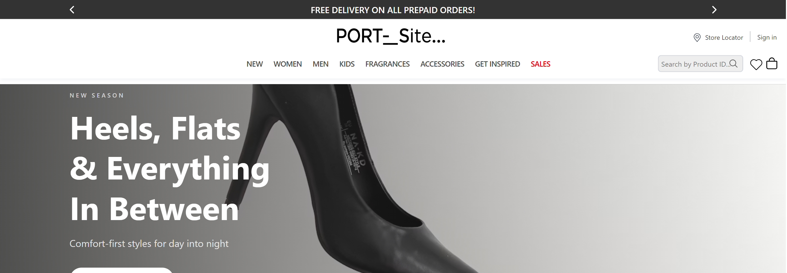
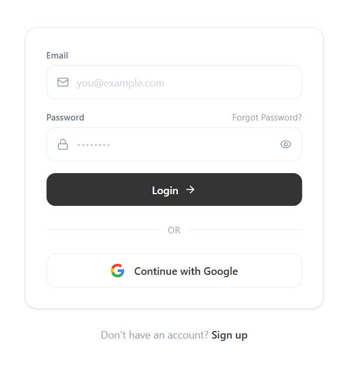
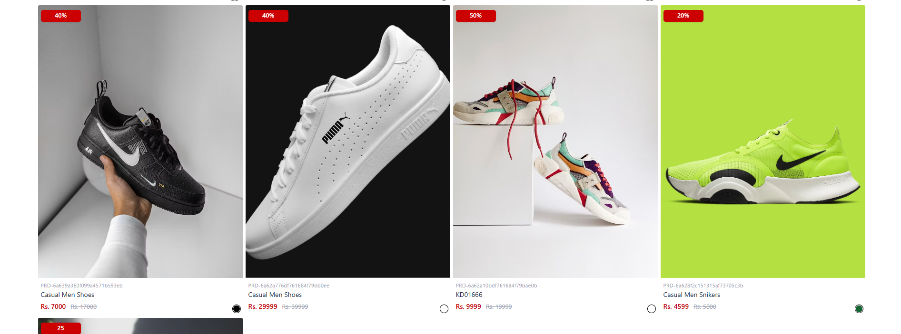
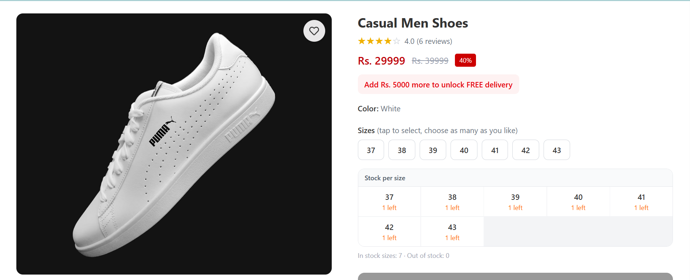
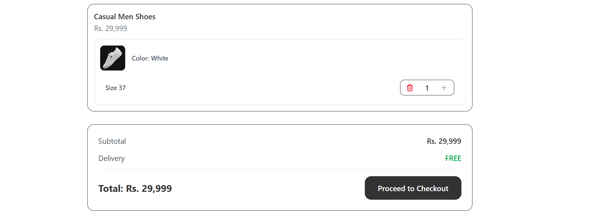
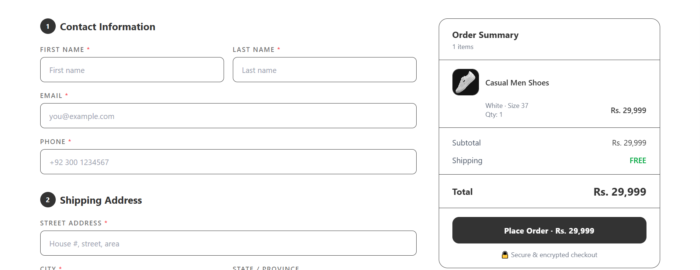
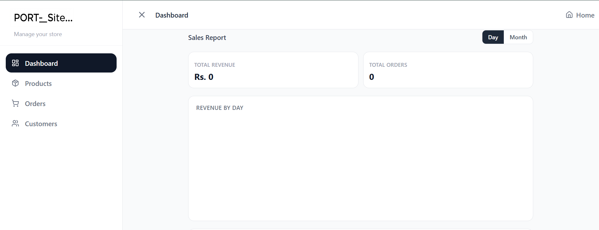
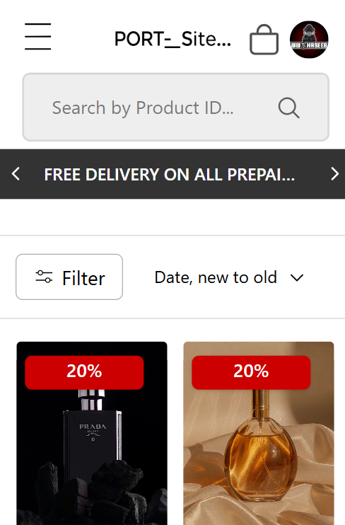

<p align="center">
  
</p>

<h1 align="center">Enterprise E-Commerce Platform</h1>

<p align="center">
  Production-ready Full Stack E-Commerce Platform built with React, Express, MongoDB & Stripe.
</p>

<p align="center">
  
  
  
  
  
  
  
  
</p>

<p align="center">
  <a href="https://e-commerce-portfolio-web.vercel.app"><b>🔗 Live Demo</b></a> •
  <a href="#installation--setup"><b>Installation</b></a> •
  <a href="#api-endpoints"><b>API Docs</b></a> •
  <a href="#contributing"><b>Contributing</b></a>
</p>

---

## 📖 Table of Contents

- [Why I Built This](#why-i-built-this)
- [Key Achievements](#key-achievements)
- [Architecture](#architecture)
- [Screenshots](#screenshots)
- [Demo Account](#demo-account)
- [Tech Stack](#tech-stack)
- [Prerequisites](#prerequisites)
- [Installation & Setup](#installation--setup)
- [Environment Variables](#environment-variables)
- [Available Scripts](#available-scripts)
- [Folder Structure](#folder-structure)
- [API Endpoints](#api-endpoints)
- [Security](#security)
- [Performance](#performance)
- [Testing](#testing)
- [Deployment](#deployment)
- [Challenges Faced](#challenges-faced)
- [What I Learned](#what-i-learned)
- [Roadmap](#roadmap)
- [Future Improvements](#future-improvements)
- [Contributing](#contributing)
- [License](#license)
- [Contact](#contact)

---

## Why I Built This

The purpose of this project was to build a production-ready e-commerce application that demonstrates enterprise-level architecture, secure authentication, scalable backend design, and real-world business workflows.

## Key Achievements

-  40+ REST APIs
-  Secure Authentication (JWT + Refresh Tokens)
-  Admin Dashboard with Analytics
-  Stripe Payment Integration
-  Google Login (OAuth)
-  Email Verification
-  Cloudinary Image Uploads
-  PDF Invoice Generation
-  Role-Based Authorization
-  Fully Responsive Design

## Architecture

```
Client (React)
      │
      ▼
Express API (Node.js)
      │
      ▼
MongoDB (Atlas)
      │
      ├──▶ Cloudinary (Image Storage)
      ├──▶ Stripe (Payments)
      └──▶ Email Service (Verification / Invoices)
```

## Screenshots

> Replace the placeholders below with actual screenshots stored in `./docs/screenshots/`.

| Home | Login | Products |
|---|---|---|
|  |  |  |

| Product Details | Cart | Checkout |
|---|---|---|
|  |  |  |

| Dashboard | Analytics | Mobile View |
|---|---|---|
|  |  |

## Demo Account

> ⚠️ **Note:** This is a live personal Gmail address. Publishing it in a public README means anyone can use it to log in, and it may attract spam. Strongly recommend creating a separate `demo@yourdomain.com`–style account just for this purpose instead.

```
Email: hm597457@gmail.com
Password: Demo@1234
```

## Tech Stack

**Frontend:** React, Redux, React Router, Axios
**Backend:** Node.js, Express
**Database:** MongoDB (Atlas)
**Auth:** JWT, HTTP-only Cookies, Google OAuth
**Payments:** Stripe
**Storage:** Cloudinary
**Deployment:** Vercel (frontend), Render (backend)

## Prerequisites

Before running this project locally, make sure you have:

- **Node.js** v18 or higher
- **npm** or **yarn**
- **MongoDB** (local instance or a MongoDB Atlas connection string)
- **Cloudinary** account (for image uploads)
- **Stripe** account (for payment testing)

## Installation & Setup

```bash
# 1. Clone the repository
git clone https://github.com/Muhammad-Haseeb591/E-commerce_Portfolio_web.git
cd E-commerce_Portfolio_web

# 2. Install backend dependencies
cd backend
npm install

# 3. Install frontend dependencies
cd ../frontend
npm install

# 4. Set up environment variables
# (see Environment Variables section below)

# 5. Run the backend
cd ../backend
node app.js

# 6. Run the frontend
cd ../frontend
npm run dev
```

The app will be available at `http://localhost:5173` (frontend) and `http://localhost:3000` (backend), or whichever ports you configure.

## Environment Variables

Create a `.env` file inside the `backend/` directory with the following keys:

```env
PORT=3000
MONGO_URI=your_mongodb_connection_string
JWT_ACCESS_SECRET=your_jwt_access_secret
JWT_REFRESH_SECRET=your_jwt_refresh_secret
CLOUDINARY_CLOUD_NAME=your_cloudinary_name
CLOUDINARY_API_KEY=your_cloudinary_key
CLOUDINARY_API_SECRET=your_cloudinary_secret
STRIPE_SECRET_KEY=your_stripe_secret_key
STRIPE_WEBHOOK_SECRET=your_stripe_webhook_secret
EMAIL_HOST=your_smtp_host
EMAIL_USER=your_email
EMAIL_PASS=your_email_password
GOOGLE_CLIENT_ID=your_google_oauth_client_id
GOOGLE_CLIENT_SECRET=your_google_oauth_client_secret
CLIENT_URL=http://localhost:5173
```

And inside `frontend/`, create a `.env` file:

```env
VITE_API_BASE_URL=http://localhost:3000
VITE_STRIPE_PUBLIC_KEY=your_stripe_publishable_key
```

> ⚠️ Never commit `.env` files. Make sure `.env` is listed in `.gitignore`.

## Available Scripts

**Backend** (`/backend`)

| Command | Description |
|---|---|
| `node app.js` | Start server |
| `npx nodemon app.js` | Start server with auto-reload (requires `nodemon`) |
| `npm start` | Start server in production mode |

**Frontend** (`/frontend`)

| Command | Description |
|---|---|
| `npm run dev` | Start Vite dev server |
| `npm run build` | Create a production build |
| `npm run preview` | Preview the production build locally |
| `npm run lint` | Run ESLint checks |

## Folder Structure

```
frontend/
 ├── src/
 │   ├── components/
 │   ├── pages/
 │   ├── hooks/
 │   ├── services/
 │   ├── routes/
 │   ├── redux/
 │   ├── utils/
 │   └── assets/
backend/
 ├── controllers/
 ├── middleware/
 ├── models/
 ├── routes/
 ├── services/
 ├── utils/
 ├── config/
 └── uploads/
```

## API Endpoints

| Method | Endpoint | Description |
|---|---|---|
| POST | `/auth/login` | Log in a user |
| POST | `/auth/register` | Register a new user |
| GET | `/products` | Fetch all products |
| POST | `/orders` | Create a new order |
| GET | `/orders/:id` | Fetch order by ID |

## Security

- JWT Authentication (Access + Refresh Tokens)
- HTTP-Only Cookies
- Password Hashing (bcrypt)
- Protected Routes (client & server)
- Role-Based Authorization
- Input Validation
- Secure Environment Variables

## Performance

- Lazy Loading
- Image Optimization
- Pagination
- Debounced Search
- Code Splitting
- Optimized API Calls

## Testing

```bash
# Run backend tests
cd backend
npm test

# Run frontend tests
cd frontend
npm test
```

> Add details here about your testing framework (Jest, Supertest, React Testing Library, etc.) and current coverage once tests are in place.

## Deployment

- **Frontend:** Vercel
- **Backend:** Render
- **Database:** MongoDB Atlas
- **Image Storage:** Cloudinary
- **Payments:** Stripe

## Challenges Faced

- Implementing secure JWT authentication with refresh tokens
- Managing role-based authorization for admin and customers
- Integrating Stripe payment workflow
- Handling image uploads with Cloudinary
- Preventing duplicate cart items
- Optimizing MongoDB queries
- Implementing email verification securely
- Solving CORS issues during deployment
- Handling protected routes on both client and server

## What I Learned

- Authentication best practices
- REST API architecture
- MongoDB optimization
- Secure payment integration
- Role-based authorization
- Error handling
- Production deployment
- Environment variable management

## Roadmap

- [x] Authentication
- [x] Product Management
- [x] Payments
- [x] Reviews
- [ ] Docker
- [ ] Redis
- [ ] Elasticsearch
- [ ] Microservices

## Future Improvements

- Redis caching
- Elasticsearch search
- Docker containerization
- Kubernetes orchestration
- Microservices architecture
- GraphQL API layer
- Recommendation system
- AI chatbot
- Wishlist sharing
- Multi-language support

## Contributing

Contributions are welcome! To contribute:

1. Fork the repository
2. Create a new branch (`git checkout -b feature/your-feature`)
3. Commit your changes (`git commit -m "Add your feature"`)
4. Push to the branch (`git push origin feature/your-feature`)
5. Open a Pull Request

Please make sure your code follows the existing style and includes relevant tests where applicable.

## License

This project is licensed under the [MIT License](./LICENSE).

## Contact

**Muhammad Haseeb**

- Live Demo: [e-commerce-portfolio-web.vercel.app](https://e-commerce-portfolio-web.vercel.app)
- LinkedIn: [linkedin.com/in/muhammad-haseeb-65394b320](https://www.linkedin.com/in/muhammad-haseeb-65394b320)
- GitHub: [@Muhammad-Haseeb591](https://github.com/Muhammad-Haseeb591)
- Email: livehaseeb822@gmail.com

---

<p align="center">If you found this project useful, consider giving it a ⭐ on GitHub!</p>
